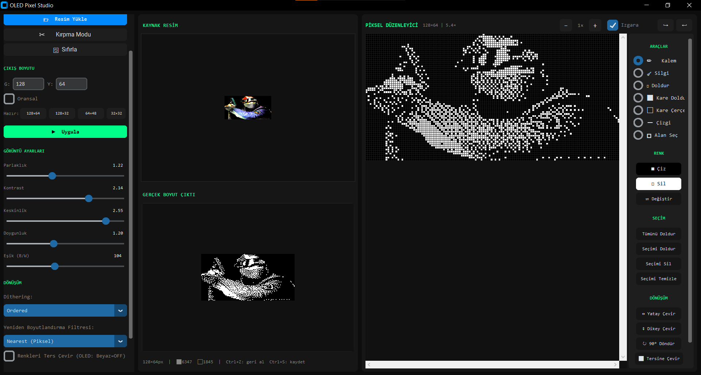
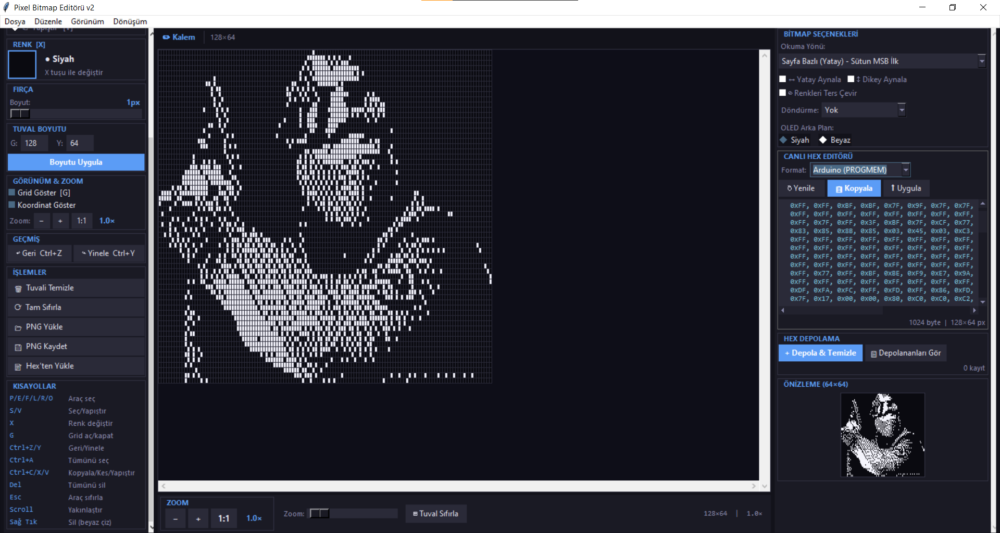

# Lcd ekranlar için fotoğraf dönüştürücü sistem

## resimden pixele dönüşüm

- ilk olarak resim buraya aktarılır burdan gerekli oran ve pixel 
düzenlemeleri maskeleme vs. yapılabilir.
---

---

## pixel resminden hex koduna dönüşüm

- resim yüklenerek veya sadece çizim yapılarak hex kodu üretilebilir pratiktir.
---

---

- üretilen hex kodu mikrodenetleyici ortamına vs aktarılabilir. 